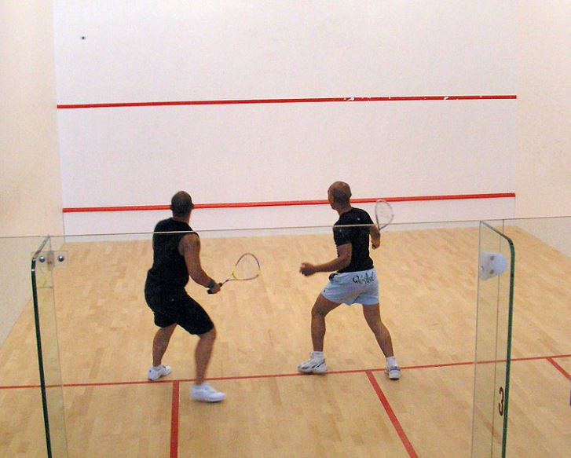

<!-- CELL 2.0 | markdown -->
# Chapter 2 — Training a Spiking Neural Network

In Chapter 1 we built a single LIF neuron and met the surrogate gradient. Now we will:

1. stack LIF neurons into a **deep spiking network**,
2. train it on a real movement-sensor dataset with **backpropagation through time** using
   the surrogate gradient, and
3. **benchmark** it against a conventional MLP and a GRU.

> **Objective.** Train a 3-layer SNN end-to-end, and understand *why* the spike's
> non-differentiability is not an obstacle.

> **Bonus.** The optional bonus at the **end of the  notebook** rewrites the spike as 
> *forward-gradient injection* — one differentiable expression — and uses `torch.compile` 
> for a large speed-up. Get there if you have time.

<!-- CELL 2.1 | markdown -->
## From one neuron to a deep network

A **layer** of LIF neurons is just many neurons in parallel. Each neuron receives a
weighted sum of the layer's inputs as its input current:

$$I^{(\ell)}[t] = W^{(\ell)} \, s^{(\ell-1)}[t], \qquad
  V^{(\ell)}[t] = \beta\,V^{(\ell)}[t-1] + I^{(\ell)}[t],$$

then thresholds and resets exactly as before, emitting a spike vector
$s^{(\ell)}[t]$. We stack three such layers. The network is **feedforward in space**
(layer $\ell$ feeds layer $\ell+1$) but **recurrent in time**: each neuron's membrane
carries state from one timestep to the next. *This temporal recurrence is the
"recurrent dynamics" of the SNN* — there are no explicit lateral weights here.

<em>From one neuron to a deep SNN: the Chapter-1 LIF unit, stacked into three layers (feedforward in space) feeding a linear readout.</em>

<em>The same network unrolled in both axes: feedforward in space (↑) and recurrent in time through the membrane state (→).</em>

Our input is a length-$T$ multivariate time series. At every timestep we feed one
sample $x[t]$ into the first layer. After the last spiking layer we apply a linear
**readout** at each timestep and **average the logits over time**; the time-averaged
logits go into a standard **cross-entropy** classification loss.

> Why average over time? Each timestep produces a noisy, spike-driven vote for each
> class. Averaging integrates evidence across the whole sequence into one prediction.

<em>The readout: a linear layer per timestep produces logits, which are averaged over time and compared to the label with cross-entropy.</em>

<!-- CELL 2.2 | code -> scripts/02_training_snns.py -->
**Setup.** Imports and device selection.

<!-- CELL 2.3 | markdown -->
## Subtask 1 — The spike with a surrogate gradient

Recall the problem: the spike is a Heaviside step whose derivative is zero, so no
gradient flows. The classic fix in PyTorch is a **custom `autograd.Function`**: we
define the forward pass (the hard spike) and *override* the backward pass to use the
smooth surrogate from Chapter 1 (the derivative of a sigmoid).

This is the most explicit way to write it, and it makes the "different forward vs
backward" idea concrete. Its one drawback — which the optional bonus at the end of the
notebook addresses — is that a custom `autograd.Function` cannot be traced by
`torch.compile`.

<!-- CELL 2.4 | code -> scripts/02_training_snns.py -->
**TASK.** Implement `SpikeFunction(torch.autograd.Function)`: `forward` returns
`(x >= 0).float()`; `backward` multiplies the incoming gradient by the
sigmoid-derivative surrogate `slope * σ(slope·x) · (1 − σ(slope·x))`. Wrap it in a
helper `spike_autograd(x, slope)`.

<!-- CELL 2.5 | markdown -->
## Subtask 2 — The LIF layer and the deep SNN

Now we assemble the network. `LIFLayer` wraps a `nn.Linear` (the weights $W$) and
unrolls the LIF recurrence over time, calling our spike function each step and
applying the hard reset. `DeepSNN` stacks several `LIFLayer`s and adds the
time-averaged linear readout.

<!-- CELL 2.6 | code -> scripts/02_training_snns.py -->
**TASK.** Implement `LIFLayer` (loop over time: integrate `v = beta*v + current`,
spike, hard-reset `v = v*(1-s)`, collect spikes) and `DeepSNN` (stack layers, then
`readout(spikes).mean(dim=1)`). Expose a `return_spikes`/`return_mem` flag — we reuse
it for the visualisations in Chapter 3.

<!-- CELL 2.7 | markdown -->
## The dataset — RacketSports

We use **RacketSports** from the UEA multivariate time-series archive. University
students played **badminton** or **squash** while wearing a **smartwatch**; the watch
streamed its accelerometer and gyroscope.

*The RacketSports dataset was recorded from a smartwatch's accelerometer and gyroscope while players performed badminton and squash strokes ([Zenodo](https://zenodo.org/records/3742271)).*

| property | value |
|---|---|
| channels (C) | **6** — 3-axis accelerometer + 3-axis gyroscope |
| timesteps (T) | **30** — sampled at 10 Hz over ~3 seconds |
| classes | **4** — Badminton Clear, Badminton Smash, Squash Forehand Boast, Squash Backhand Boast |
| train / test | **151 / 152** trials |

Each trial is one stroke; the task is to identify the sport **and** the stroke. It is
small (fast to train) yet temporal — a good fit for spiking models. We
z-score each channel using training-set statistics, feed the 6 channels as the input
current at each of the 30 timesteps, and read out 4 class logits.

<em>Each trial is a 6-channel × 30-timestep array; the network reads one column (one timestep) at a time.</em>

<!-- CELL 2.8 | code -> scripts/02_training_snns.py -->
**Load the data** with the helper (`aeon` downloads it automatically) and move the
tensors to the device.

<!-- CELL 2.8b | markdown -->
### What does one trial look like?

Before training, let us *see* a single swing. The 6 channels are hard to read as raw
traces, but three of them — the **accelerometer** axes — describe how the watch moves
through space. If we **integrate the acceleration twice** (acceleration → velocity →
position) we recover an approximate **3D trajectory of the swing**, and we can colour
that path by how hard the watch is accelerating at each instant.

> **Caveat.** Double-integrating a short, noisy accelerometer signal drifts, so this is
> an *illustrative* shape rather than a precise reconstruction. We remove gravity/bias
> (the per-axis mean) and a linear velocity drift to keep the path readable.

<!-- CELL 2.8c | code -> scripts/02_training_snns.py -->
*(No task — reconstruct and plot one swing's 3D trajectory, coloured by acceleration
magnitude. Change `sample_idx` to explore other trials and classes.)*

<!-- CELL 2.9 | markdown -->
## Training

`train_model` is a standard mini-batch Adam loop with cross-entropy loss. The only
thing that makes this "spiking" is the model — backpropagation through time and the
optimiser are exactly what you would use for any recurrent network, because the
surrogate gradient lets gradients flow through the spikes. We record **train
accuracy**, **test accuracy** (the dataset ships with its own split), and **wall-clock
training time**.

<!-- CELL 2.10 | code -> scripts/02_training_snns.py -->
*(No task — train the SNN built from your custom-autograd spike and record its
accuracy and training time.)*

<!-- CELL 2.11 | markdown -->
## Baselines — MLP and GRU

To judge the SNN we train two conventional networks of matched depth/width (3 layers,
64 units). Crucially, **all three models obey the same contract**: each produces a
prediction *per timestep*, and we average those logits over time before the loss — the
exact readout you built for the SNN. They differ only in *how each timestep is computed*
and *whether information crosses time*:

- **MLP** — the *memoryless* baseline. The same small network is applied to each
  timestep's 6-channel vector independently, and the per-step predictions are averaged.
  It carries **no state across time**, so it can never integrate temporal order — its
  honest deficiency.
- **GRU** — a continuous-valued **recurrent** network, the natural non-spiking
  counterpart of our SNN: it carries a hidden state across time, reads out at every
  step, and averages. This is the apples-to-apples baseline we return to in Chapter 3.

Because the three share one input→prediction contract, every later comparison
(accuracy, training curves, and the Chapter 3 efficiency analysis) is like-for-like.

<em>The three models on the same input: each predicts at every timestep and pools the logits over time. The MLP is memoryless (no state across time), while the GRU and SNN carry state along the sequence.</em>

<!-- CELL 2.12 | code -> scripts/02_training_snns.py -->
*(No task — train the MLP and GRU baselines.)*

<!-- CELL 2.15 | markdown -->
## Results & visualizations

Each `train_model` call returned a **history** (per-epoch train/test loss and
accuracy) and a training-only **wall-clock time**. We now read those out as a summary
table and three plots. Headlines to expect:

- The **SNN reaches accuracy in the same ballpark as the baselines** — a little below
  the MLP and GRU on this small dataset, which is a good result for a spiking network
  (and Chapter 3 shows what it buys you in efficiency).
- The SNN's **training time** stands out: its Python-level unrolled time loop is slower
  than the single fused ops of the MLP/GRU. The optional bonus at the end of the
  notebook shows how to close that gap with `torch.compile`.

We also save the trained SNN to `checkpoints/` — Chapter 3 loads it.

<!-- CELL 2.16 | code -> scripts/02_training_snns.py -->
*(No task — print the summary table and save the checkpoint.)*

<!-- CELL 2.17 | markdown -->
### Training curves

For each model type, plot loss and accuracy **against epoch**, with the **training**
split solid and the **test** split dashed. These show *how* learning progresses: the
loss falling, the accuracy rising, and the gap between train and test (a read on
over-fitting — expected here, since the dataset is small).

<!-- CELL 2.18 | code -> scripts/02_training_snns.py -->
*(No task — plot the train/test loss and accuracy curves for the SNN, MLP and GRU.)*

<!-- CELL 2.18b | markdown -->
### Comparing the methods directly

The per-model curves above each mix train and test on one axis. To compare *methods*
we instead overlay them on shared axes. First, **conditioned on the training set**:
how quickly and how high does each method's **training accuracy** climb? Then a single
**2×2 grid** — rows are train (top) / test (bottom), columns are loss (left) /
accuracy (right) — with every method overlaid in each panel, so differences in
optimization speed and generalization are visible at a glance.

<!-- CELL 2.18c | code -> scripts/02_training_snns.py -->
*(No task — overlay every method's training-set accuracy on one axis.)*

<!-- CELL 2.18d | code -> scripts/02_training_snns.py -->
*(No task — 2×2 grid comparing all methods: train/test × loss/accuracy.)*

<!-- CELL 2.19 | markdown -->
### Training time

Training time is a **single number per run** — the total wall-clock seconds for the
fixed number of epochs. A bar plot makes the comparison clear. The MLP and GRU are fast
because their layers are single fused ops; the SNN pays for its Python-level unrolled
time loop. That overhead is exactly what `torch.compile` removes in the optional bonus
at the end of the notebook.

<!-- CELL 2.20 | code -> scripts/02_training_snns.py -->
*(No task — bar plot of per-run training time.)*

<!-- CELL 2.21 | markdown -->
### Confusion matrices

Accuracy is one number; a **confusion matrix** shows *which* classes get confused. We
plot one per model type (MLP, SNN, GRU), normalized per true class (rows sum to 1), so
the diagonal is the per-class recall. Look for which strokes are hardest — e.g.
badminton vs squash should separate easily, while the two strokes *within* a sport may
be confused.

<!-- CELL 2.22 | code -> scripts/02_training_snns.py -->
*(No task — compute and plot the three confusion matrices on the test set.)*
